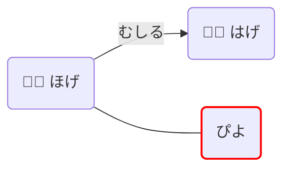

# てきとー

- 箇条書きとか
- テーブルとか

|hoge|hage|piyo|
|:--|:--|:--|
|ほげ|はげ|ぴよ|

## mermaid とか

```mermaid

graph LR;
    classDef clickable stroke:red,stroke-width:2px
    
    Hoge("🧑‍🦱 ほげ") -->|むしる| Hage("🧑‍🦲 はげ")
    Hoge --- Piyo(ぴよ):::clickable

    click Piyo "./bar/yay.md" "nanika"
```
